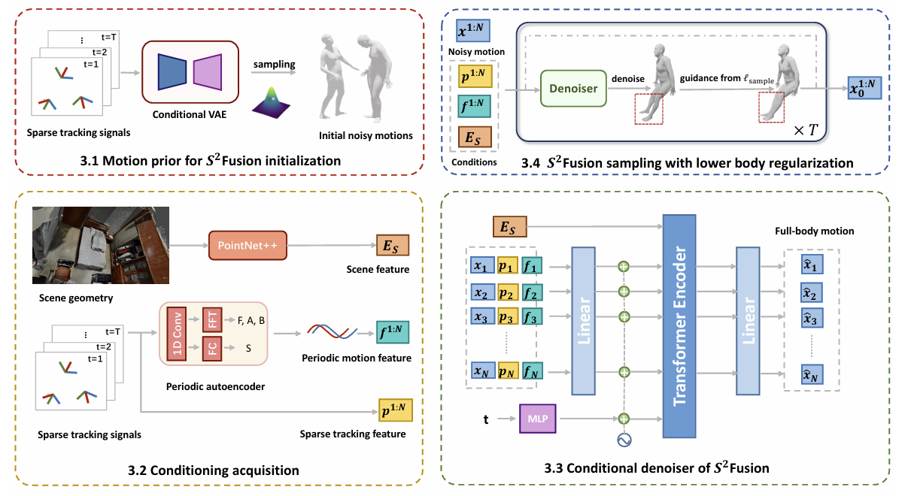

# A Unified Diffusion Framework for Scene-aware Human Motion Estimation from Sparse Signals [CVPR 2024]

The implementaion for *A Unified Diffusion Framework for Scene-aware Human Motion Estimation from Sparse Signals (CVPR 2024)* [paper](https://openaccess.thecvf.com/content/CVPR2024/papers/Tang_A_Unified_Diffusion_Framework_for_Scene-aware_Human_Motion_Estimation_from_CVPR_2024_paper.pdf)



## Requirements
```
Python >= 3.8
PyTorch3D (GPU version)
```
To install requirements:
```
pip install -r requirements.txt
```

## Citation
If you find our work useful in your research, please consider citing:

```
@article{tang2024unified,
  title={A Unified Diffusion Framework for Scene-aware Human Motion Estimation from Sparse Signals},
  author={Tang, Jiangnan and Jingya, Wang and Ji, Kaiyang and Xu, Lan and Yu, Jingyi and Shi, Ye},
  journal={arXiv preprint arXiv:2404.04890},
  year={2024}
}
```